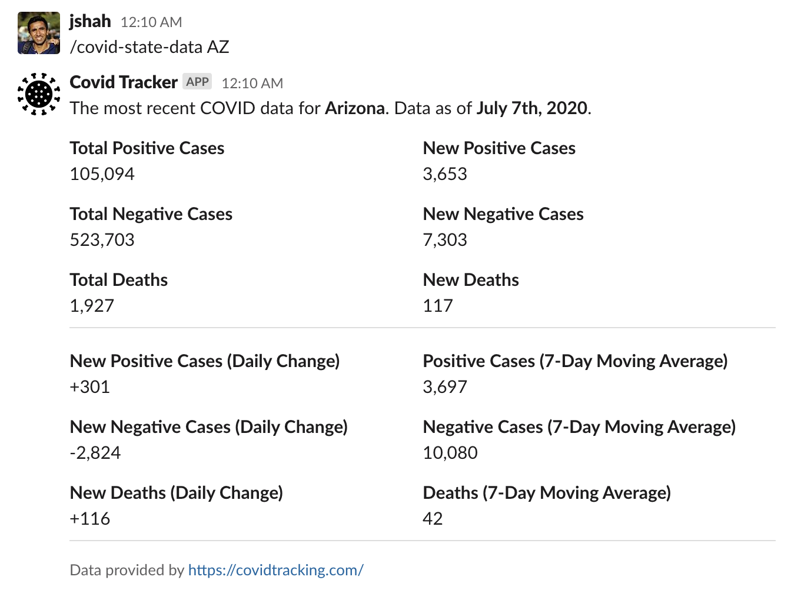
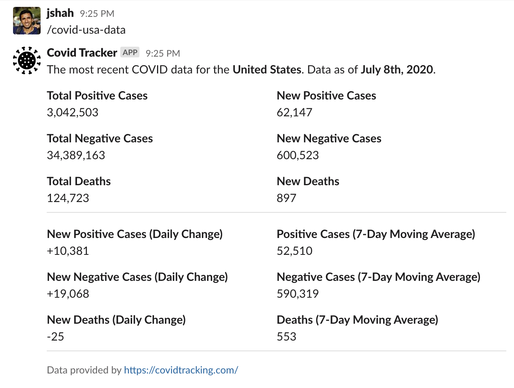

# Covid Tracker

Covid Tracker is a slack bot that uses data from https://covidtracking.com/ (updated daily) and displays it in Slack.

## Installation

Click [here](https://slack.com/oauth/v2/authorize?client_id=712956700342.1215553228262&scope=commands) to install Covid Tracker in your workspace. 

## Features

### Covid State Data

_Fetches COVID data about given state as of today._

**Usage:** `/covid-state-data [state code]`

**Example:** `/covid-state-data CA`

### Covid USA Data

_Fetches COVID data about the United States as of today._

**Usage:** `/covid-usa-data`

## Support

Please create an issue with your request.

## FAQ

**Can I Contribute?**

Yes. Please fork this repo and submit a PR. I will review it, test it manually, and merge it in.

**Will COVID data from other countries be supported?**

If there are enough requests, I can work on getting it implemented. Please make an issue with desired country.

## Attributions

Covid Tracker's app icon is made by Freepik from https://www.flaticon.com/.
